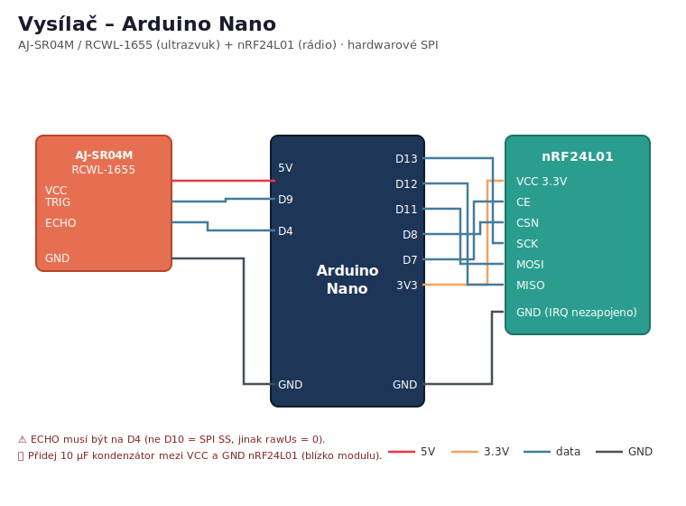
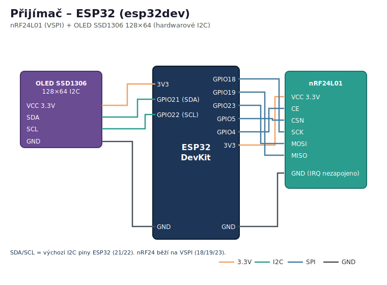

# Tank Level Meter

Bezdrátový měřič hladiny vody v nádrži. Skládá se ze dvou zařízení:

| Role | Deska | Úkol |
|------|-------|------|
| **sender** (vysílač) | Arduino Pro Mini 3.3V / 8 MHz (ATmega328) | Ultrazvukem změří vzdálenost k hladině, změří teplotu/vlhkost (SHT40), odešle data přes nRF24L01 a usne (napájeno baterií 18650, důraz na spotřebu). |
| **receiver** (přijímač) | ESP32 (esp32dev) | Přijme surovou vzdálenost, dopočítá objem vody, zobrazí ho na OLED displeji a **odešle do Home Assistantu přes MQTT**. |

Sdílený formát rádiové zprávy je v [`lib/TankProtocol/TankProtocol.h`](lib/TankProtocol/TankProtocol.h) a linkuje se do obou prostředí.

Build / upload:

```sh
pio run -e sender   -t upload
pio run -e receiver -t upload
```

---

## Zapojení – Vysílač (Arduino Pro Mini 3.3V)

Komponenty: vodotěsný ultrazvukový senzor **AJ-SR04M / RCWL-1655** + teplotní/vlhkostní senzor **SHT40** (I²C) + rádiový modul **nRF24L01**.
Měření napětí baterie probíhá interně (proti referenci 1,1 V), **nepotřebuje žádný pin**.

> ⚡ **Napájení.** Deska se napájí z článku **18650** přivedeného na **RAW**. Onboard regulátor Pro Mini je pro špičky nRF24/ultrazvuku slabý, proto 3,3 V rail (pin **VCC**) řeš externím **LDO (HT7333 / MCP1700)**. Ultrazvuk RCWL-1655 (3–5,5 V tolerantní) běží přímo z **RAW**; nRF24 a SHT40 (oba max 3,6 V!) musí jít z regulovaných 3,3 V.

### AJ-SR04M / RCWL-1655 (ultrazvukový senzor)

Vodotěsný senzor s odděleným měničem (JSN-SR04T kompatibilní), vhodný do nádrže.
V základním režimu **Mode 1** je Trig/Echo rozhraní pinově kompatibilní s HC-SR04, proto se používá knihovna NewPing beze změny.

| Pin senzoru | Arduino Pro Mini | Poznámka |
|-------------|------------------|----------|
| VCC  | RAW  | napájení z baterie (~3,8 V); odlehčuje 3,3 V rail |
| TRIG | D9   | `TRIGGER_PIN` |
| ECHO | D4   | `ECHO_PIN` – ECHO high ~3,8 V, zvaž sériový ~1 kΩ |
| GND  | GND  | |

> ⚠️ **ECHO nesmí být na D10.** D10 je hardwarový SS pin SPI; `radio.begin()` ho přepne na OUTPUT a echo by pak nešlo číst (`rawUs = 0`). Viz komentář v [`src/sender/main.cpp`](src/sender/main.cpp).
>
> 📏 **Mrtvá zóna ~20–25 cm.** Senzor neměří blíž než cca 25 cm, proto musí být umístěn dostatečně nad maximální hladinou. Tomu odpovídá `offset 58 cm` v konfiguraci nádrže ([`src/receiver/main.cpp`](src/receiver/main.cpp)). Max. dosah ≈ 4–4,5 m.
>
> 🔧 **Režim (Mode):** osazením rezistoru na pozici R19/R27 lze přepnout na UART (sériový) výstup. Tento projekt počítá s výchozím **Mode 1** (Trig/Echo) – nic neosazuj.

### SHT40 (teplota/vlhkost, hardwarové I²C)

| Pin senzoru | Arduino Pro Mini | Poznámka |
|-------------|------------------|----------|
| VCC | **3,3 V (VCC)** | senzor 1,08–3,6 V – **nepřipojovat na RAW/5 V!** |
| GND | GND             | |
| SDA | A4              | pevný I²C SDA na ATmega328 |
| SCL | A5              | pevný I²C SCL na ATmega328 |

> 💡 I²C adresa **0x44** (`SHT40_I2C_ADDR_44`). Pokud modul nemá vlastní pull-upy, přidej 4k7–10k z SDA i SCL na 3,3 V.

### nRF24L01 (rádio, hardwarové SPI)

| Pin modulu | Arduino Pro Mini | Poznámka |
|------------|------------------|----------|
| VCC  | **3,3 V (VCC)** | modul je 3,3V – nepřipojovat na RAW/5 V! |
| GND  | GND             | |
| CE   | D7              | `RF_CE_PIN` |
| CSN  | D8              | `RF_CSN_PIN` |
| SCK  | D13             | HW SPI SCK |
| MOSI | D11             | HW SPI MOSI |
| MISO | D12             | HW SPI MISO |
| IRQ  | – (nezapojeno)  | přerušení se nepoužívá |

> 💡 Doporučení: mezi VCC a GND modulu nRF24L01 přidej **kondenzátor ≥47 µF** (blízko modulu). Stabilizuje napájení při vysílacích špičkách a řeší většinu problémů s `isChipConnected() = NE` i s propady 3,3 V railu při `radio.write()`.

---

## Zapojení – Přijímač (ESP32 / esp32dev)

Komponenty: rádiový modul **nRF24L01** + **OLED displej SSD1306 128×64 (I2C)** + **ovládací tlačítko** (přepínání obrazovek).

### nRF24L01 (rádio, VSPI)

| Pin modulu | ESP32 (GPIO) | Poznámka |
|------------|--------------|----------|
| VCC  | 3,3 V         | |
| GND  | GND           | |
| CE   | GPIO4         | `RF_CE_PIN` |
| CSN  | GPIO5         | `RF_CSN_PIN` |
| SCK  | GPIO18        | VSPI SCK |
| MISO | GPIO19        | VSPI MISO |
| MOSI | GPIO23        | VSPI MOSI |
| IRQ  | – (nezapojeno)| |

### OLED SSD1306 128×64 (hardwarové I2C)

| Pin displeje | ESP32 (GPIO) | Poznámka |
|--------------|--------------|----------|
| VCC | 3,3 V  | |
| GND | GND    | |
| SDA | GPIO21 | výchozí I2C SDA na ESP32 |
| SCL | GPIO22 | výchozí I2C SCL na ESP32 |

> Displej se inicializuje přes U8g2 s `U8X8_PIN_NONE` (bez reset pinu) – viz [`src/receiver/OledDisplay.cpp`](src/receiver/OledDisplay.cpp).

### Ovládací tlačítko (přepínání obrazovek)

Krátkým stiskem se cyklicky přepínají obrazovky displeje: **měření → graf → diagnostika → teplota/vlhkost** a zpět.

| Pin tlačítka | ESP32 (GPIO) | Poznámka |
|--------------|--------------|----------|
| 1. vývod | GPIO27 | `BUTTON_PIN`, interní pull-up (stisk = LOW) |
| 2. vývod | GND    | druhá strana tlačítka |

> 💡 Tlačítko se zapojuje **pin → tlačítko → GND**, žádný externí rezistor není potřeba – využívá se interní pull-up (`INPUT_PULLUP`). Stisk se softwarově ošetřuje proti zákmitům (debounce 50 ms). Viz [`src/receiver/main.cpp`](src/receiver/main.cpp).

---

## Společná RF konfigurace

Aby spolu obě strany komunikovaly, musí sedět tyto hodnoty ([`TankProtocol.h`](lib/TankProtocol/TankProtocol.h)):

| Parametr | Hodnota |
|----------|---------|
| Kanál (`TANK_RF_CHANNEL`) | 76 |
| Adresa (`TANK_RF_ADDRESS`) | `0xF0F0F0F0E1` |
| Data rate | `RF24_1MBPS` |
| PA level | `RF24_PA_HIGH` |

---

## Home Assistant přes MQTT (přijímač)

Přijímač (ESP32) se připojí na WiFi a posílá naměřené hodnoty na MQTT broker, který běží na Home Assistantu. Díky **MQTT discovery** se entity v HA vytvoří automaticky – není potřeba nic psát do `configuration.yaml`.

### Nastavení přihlašovacích údajů

Přihlašovací údaje nejsou v gitu. Zkopíruj šablonu a vyplň své hodnoty:

```sh
cp src/receiver/Secrets.example.h src/receiver/Secrets.h
```

V [`src/receiver/Secrets.h`](src/receiver/Secrets.h) vyplň `WIFI_SSID`, `WIFI_PASSWORD`, `MQTT_HOST` (IP brokera), `MQTT_PORT`, `MQTT_USER` a `MQTT_PASSWORD`. Soubor je v `.gitignore`.

> Potřebuješ běžící MQTT broker a v HA integraci **MQTT**. Pro Home Assistant v Dockeru (HA Container, bez add-onů) je připravený Mosquitto broker jako samostatný kontejner – viz [`docker/mosquitto/README.md`](docker/mosquitto/README.md).

### Vytvořené entity

Pod zařízením **Tank Level Meter** se v HA objeví:

| Entita | Jednotka | Stav (`value_json`) |
|--------|----------|---------------------|
| Objem vody | L | `volume` |
| Vzdálenost | cm | `distance` |
| Naplnění | % | `percent` |
| Baterie vysílače | V | `battery` |

### MQTT topiky

| Topic | Význam |
|-------|--------|
| `tanklevelmeter/state` | JSON se všemi hodnotami, např. `{"distance":120,"volume":3400,"percent":56,"battery":1.320}` |
| `tanklevelmeter/status` | dostupnost `online` / `offline` (LWT – při výpadku/ztrátě signálu HA entity zešednou) |
| `homeassistant/sensor/tanklevelmeter/<key>/config` | discovery konfigurace (retained) |

Spojení s WiFi i MQTT se udržuje neblokujícím způsobem v `loop()`, takže příjem z rádia tím není přerušen. Logika je v [`src/receiver/HomeAssistantMqtt.cpp`](src/receiver/HomeAssistantMqtt.cpp).

---

## Schémata a referenční pinouty

Odkazy na pinouty a datasheety použitých desek a komponent:

- **Arduino Pro Mini** – [oficiální pinout (Arduino Docs)](https://docs.arduino.cc/retired/boards/arduino-pro-mini/) · [SparkFun Pro Mini hookup guide](https://learn.sparkfun.com/tutorials/using-the-arduino-pro-mini-33v)
- **SHT40** – [Sensirion SHT4x datasheet](https://sensirion.com/products/catalog/SHT40)
- **ESP32 DevKit (esp32dev)** – [Espressif pinout](https://docs.espressif.com/projects/esp-idf/en/latest/esp32/hw-reference/esp32/get-started-devkitc.html) · [Random Nerd Tutorials – ESP32 pinout reference](https://randomnerdtutorials.com/esp32-pinout-reference-gpios/)
- **nRF24L01** – [pinout obrázek (RF24 knihovna)](.pio/libdeps/sender/RF24/images/pinout.jpg) · [Nordic nRF24L01+ datasheet](https://www.sparkfun.com/datasheets/Components/SMD/nRF24L01Pluss_Preliminary_Product_Specification_v1_0.pdf)
- **AJ-SR04M / RCWL-1655** – [datasheet (AJ-SR04M, dronebotworkshop)](https://dronebotworkshop.com/wp-content/uploads/2021/01/AJ-SR04M-Datasheet.pdf) · [popis režimů a zapojení](https://dronebotworkshop.com/waterproof-ultrasonic-sensor/)
- **OLED SSD1306 128×64 I2C** – [SSD1306 datasheet](https://cdn-shop.adafruit.com/datasheets/SSD1306.pdf)

### Schémata zapojení projektu

| Vysílač (Arduino Pro Mini 3.3V) | Přijímač (ESP32) |
|---------------------------------|------------------|
| [](docs/schema_sender.svg) | [](docs/schema_receiver.svg) |

Zdrojové soubory: [`docs/schema_sender.svg`](docs/schema_sender.svg) · [`docs/schema_receiver.svg`](docs/schema_receiver.svg)
